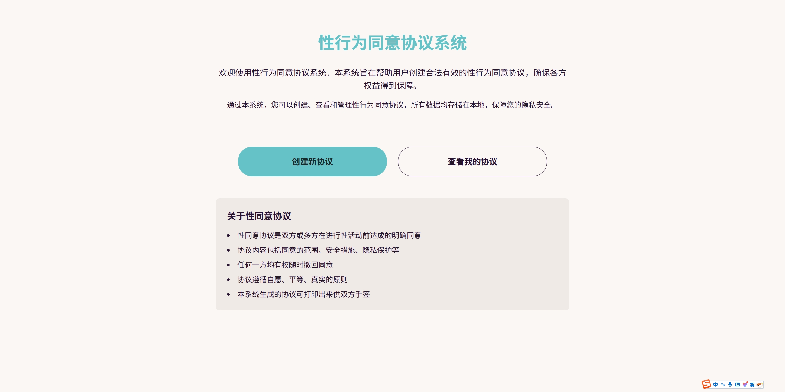
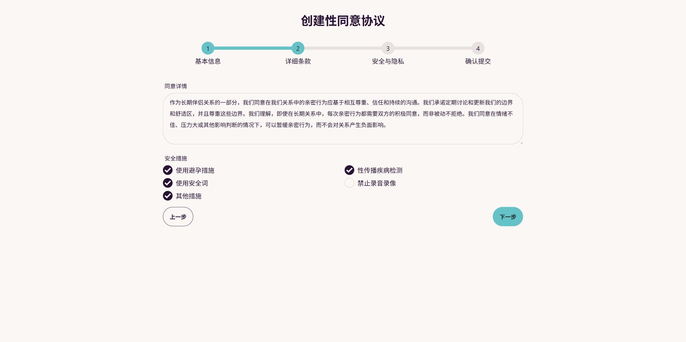
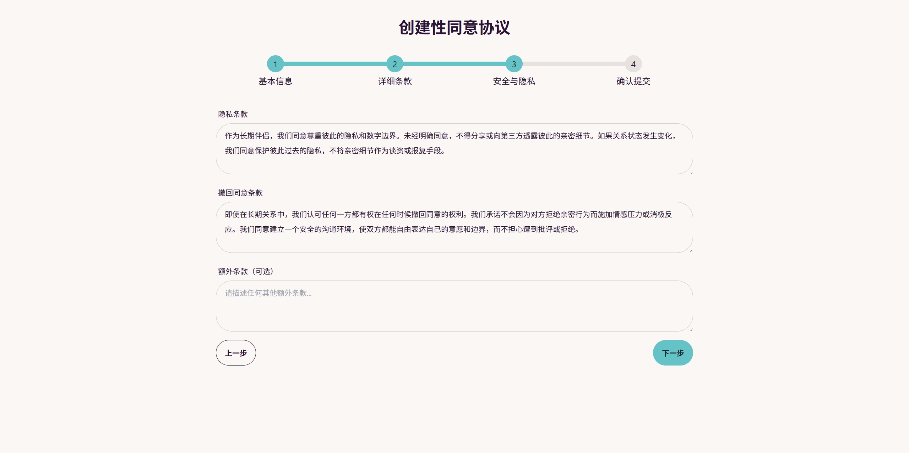
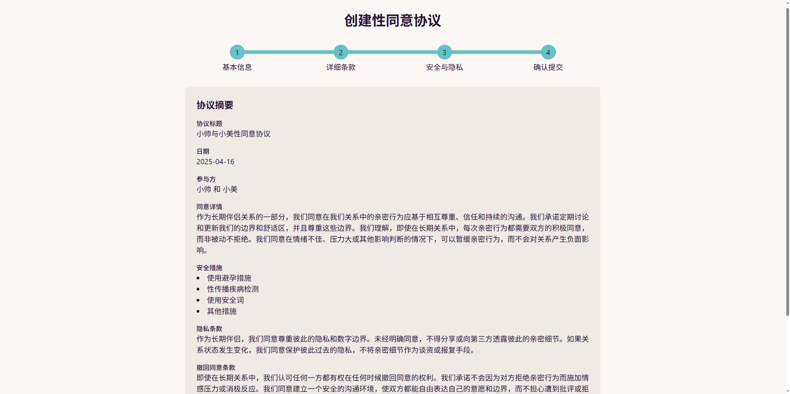
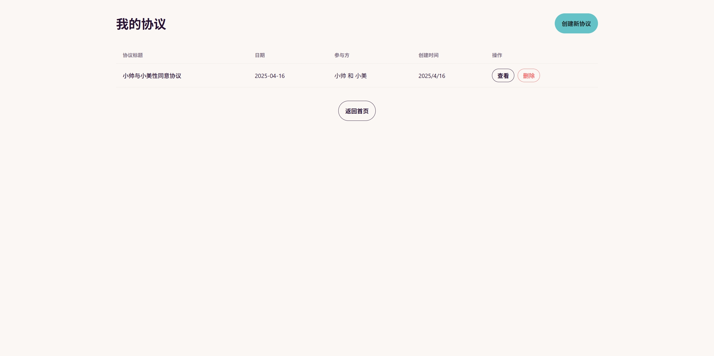
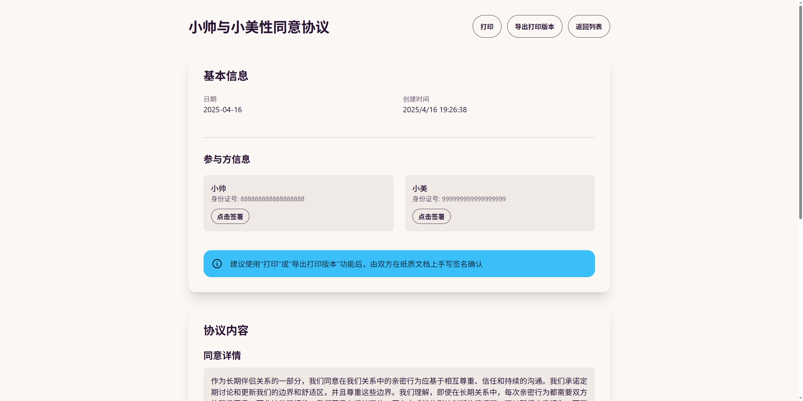

# 性行为同意协议系统

     

一个用于创建、签署和管理性行为同意协议的 Web 应用程序。该应用允许用户在线创建详细的性行为同意协议，并通过数字签名方式进行签署，同时支持导出为 PDF 格式保存。

## 在线预览

您可以通过以下链接访问在线演示版本：
[在线演示版本](https://sex-agreement-app.pages.dev/)

## 功能特性

- 创建自定义性同意协议
- 多步骤表单引导用户完成协议创建
- 协议可包含详细条款、安全措施、隐私条款等
- 数字签名功能
- 导出 PDF 文档
- 本地存储所有数据，保障隐私安全
- 响应式设计，适配移动和桌面设备
- 美观直观的用户界面

## 应用截图

### 首页



### 创建协议流程






### 协议管理




## 技术栈

- Next.js - React 框架
- React - 用户界面库
- TypeScript - 类型安全
- TailwindCSS - 样式框架
- DaisyUI - UI 组件库
- jsPDF - PDF 生成
- React Hook Form - 表单处理
- localStorage - 本地数据存储

## 如何使用

1. 克隆本仓库
2. 安装依赖：`npm install`
3. 启动开发服务器：`npm run dev`
4. 在浏览器中访问：`http://localhost:3000`

## 部署

本项目可以部署到任何支持静态网站或 Node.js 服务的平台：

```bash
npm run build
npm run start
```

## 本地存储

所有协议数据存储在浏览器的 localStorage 中，确保数据不会离开用户设备，保障用户隐私。

## 注意事项

- 此系统生成的协议仅作为参考，在某些司法管辖区可能不具备法律效力
- 用户应理解真实的同意是持续的、可以撤回的过程
- 在紧急或敏感情况下，请咨询专业法律建议

## Star History

[](https://www.star-history.com/#123xiao/sex-agreement-app&Date)
